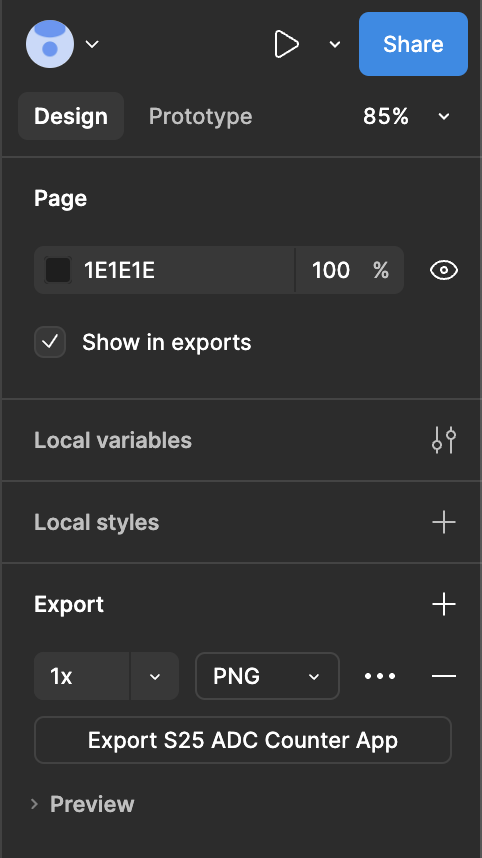
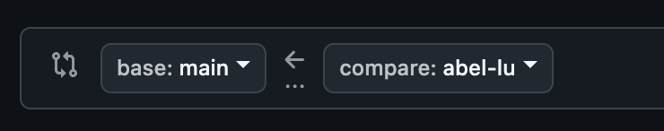

# Member To-do List

## January 28, 2025 Meeting

### Setup

1. Make account at https://www.figma.com/ using a personal (non-NCSU) email.
2. Login to your new account.
3. Create a new design file and open it.
4. In the sidebar on the left, click "Assets" to go into the Assets menu.
5. Locate and select "iOS 18 and iPadOS 18" library and select it.
6. Find the "Bezels" section of the library and drag an iPhone 16 bezel into the design area.

### Activity

Design a screen for a simple counter app. The screen should feature a number in the center that can be incremented or decremented by clicking different buttons. The screen does not need to be functional (i.e. the buttons don't need to actually change the number).

Achieve this design using using only assets from the "iOS and iPadOS 18" and "Material Design 3" libraries. You are not required to use both of these, but you are not allowed to use other asset libraries.

An example can be found here: https://tallycount.app/

When you are finished, add it to this repo in the `counter-wireframes` folder by doing the following:

1. Clone the repo to your local machine:

```bash
git clone git@github.com:NCSU-App-Development-Club/react-native-s25.git
cd react-native-s25
```

2. Create a new branch: `git checkout -b <first name-last name>` (for example, `Abel Lu` would create a branch called `abel-lu` by running `git checkout -b abel-lu`)

3. Export your Figma design--go to the right menu, which should have an `Export` section, and click `Export <your design name>`--add it to the `counter-wireframes` directory on your local version of the repo, then rename it to `your-name.png` (with your full name; same format as the branch name, like `abel-lu.png`)



4. Stage and commit your changes, then push to the GitHub repository (you can replace the commit message `my design` with whatever you want, and branch-name will be your name, ex. `abel-lu`):

```bash
git add .
git commit -m "my design"
git push origin <branch-name>
```

5. Open a Pull Request on GitHub: go to the `Pull requests` tab, click `New pull request`, ensure that the `base` branch is `main` and the `compare` branch is the branch you created (e.g. `abel-lu`), and click `Create pull request`. Finally, click `Create pull request` again on this page.


