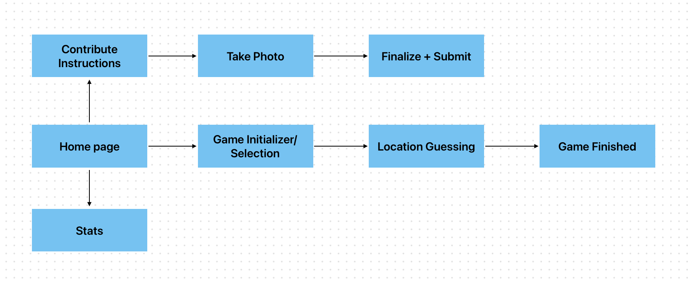

# NCSUGuessr Designs



## Overview

In small groups, you will design a screen for NCSUGuessr in Figma. Each group should only have one submission.

## Guidelines

- Try to stick to [NCSU colors](https://brand.ncsu.edu/assets/nc-state-color.pdf).
- Interactible elements should be in Wolfpack Red (#CC0000).

## Group Assignments

- Team 1: [Home Screen](https://github.com/NCSU-App-Development-Club/ncsuguessr/issues/1)
- Team 2: [Game Initializer/Selection Screen](https://github.com/NCSU-App-Development-Club/ncsuguessr/issues/5)
- Team 3: [Stats Screen](https://github.com/NCSU-App-Development-Club/ncsuguessr/issues/3)
- Team 4: [Game Screen](https://github.com/NCSU-App-Development-Club/ncsuguessr/issues/4)

> [!NOTE]
> All designs should be in light mode. If you complete light mode early, feel free to make and submit a dark mode version (make sure the dark mode design image ends in `-dark.png`).

## To-do List:

1. Clone the ncsuguessr repo:
   ```bash
   git clone https://github.com/NCSU-App-Development-Club/ncsuguessr.git
   ```
2. Create a new branch off of the development branch. Name the branch according to the screen you are designing. Replace `<screen-name>` with the name of the screen you are designing in kebab case (words separated by hyphens; e.g. `game-initializer.png` or `finalize-submit.png`). Push the new branch:

   ```bash
   git checkout development
   git checkout -b <screen-name>
   ```

3. Push the new branch:

   ```bash
   git push --set-upstream origin <screen-name>
   ```

4. Export your Figma design--go to the right menu, which should have an Export section, and click Export <your design name>--add it to the counter-designs directory on your local version of the repo, then rename it to `<screen-name>.png` (with your the name of the screen you are designing; same format as the branch name, like `take-photo.png`)

5. Stage and commit your changes, then push to the GitHub repository (you can replace the commit message `team design` with whatever you want, and branch-name will be your name, ex. `take-photo`):

```bash
git add .
git commit -m "team design"
git push
```

6. Open a Pull Request on GitHub: go to the `Pull requests` tab, click `New pull request`, ensure that the `base` branch is `development` and the `compare` branch is the branch you created (e.g. `take-photo`), and click `Create pull request`. Finally, click `Create pull request` again on this page.
